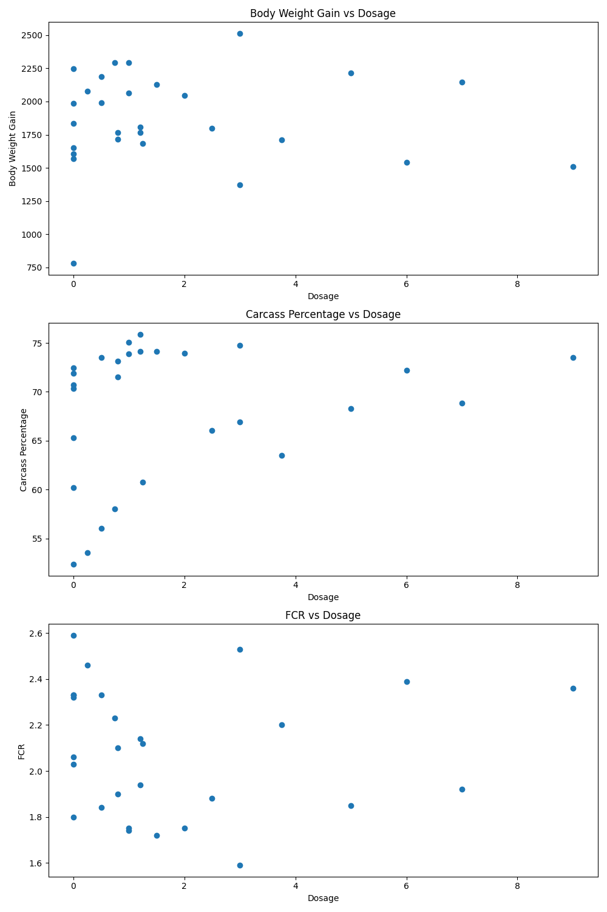
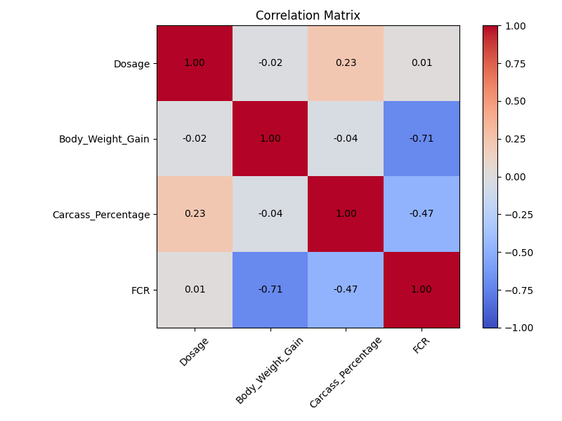

# LKTI Data Analysis

A comprehensive data analysis tool for examining the relationship between dosage levels and key performance indicators (Body Weight Gain, Carcass Percentage, and Feed Conversion Ratio) in animal science research.

## Overview

This project provides tools for analyzing experimental data from animal feeding trials, specifically examining how different dosage levels affect:
- Body Weight Gain (BWG)
- Carcass Percentage
- Feed Conversion Ratio (FCR)

The analysis includes statistical tests, correlation analysis, and data visualization to help researchers draw evidence-based conclusions about optimal dosage levels.

## Features

- **Data Cleaning & Preprocessing**: Automatically identifies relevant columns and handles non-numeric values
- **Statistical Analysis**: 
  - ANOVA analysis for categorical dosage levels
  - Regression analysis for continuous dosage data
  - Confidence level customization
- **Data Visualization**:
  - Bar charts, scatter plots, and box plots
  - Correlation heatmaps
  - Downloadable high-quality figures
- **Interactive Dashboard**: Web-based interface for exploring data without coding knowledge

## Installation

1. Clone this repository:
   ```
   git clone https://github.com/yourusername/LKTI.git
   cd LKTI
   ```

2. Install required dependencies:
   ```
   pip install -r requirements.txt
   ```

## Usage

### Command-line Analysis

Run the basic analysis script to generate result plots:

```
python analyze_data.py
```

This will create visualization files (`dosage_comparison.png` and `correlation_matrix.png`) in the project directory.

### Interactive Dashboard

Launch the interactive Streamlit dashboard:

```
streamlit run app.py
```

This will open a web browser with the interactive dashboard where you can:
- View and filter data
- Generate customized visualizations
- Perform statistical analyses with adjustable confidence levels
- Download results

## Data Format

The application expects an Excel file named `Data LKTI.xlsx` with columns containing:
- Dosage levels 
- Body Weight Gain measurements
- Carcass Percentage values
- FCR (Feed Conversion Ratio) values

The application will attempt to automatically identify these columns based on common naming patterns.

## Requirements

- Python 3.8+
- pandas
- numpy
- matplotlib
- streamlit
- seaborn
- scipy
- statsmodels
- openpyxl

## Screenshots




## License

[Add your license information here]

## Contributing

Contributions to improve the analysis methods, visualization capabilities, or user interface are welcome. Please feel free to submit a pull request or open an issue.

## Contact

[Your contact information]